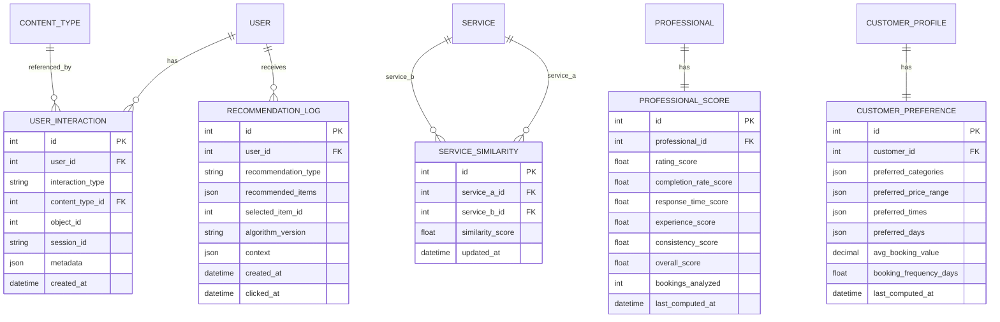

# ML App — Documentation

## Table of Contents

- [Overview](#overview)
- [Architecture](#architecture)
- [Data Models](#data-models)
- [Recommendation Engine](#recommendation-engine)
- [Predictive Analytics](#predictive-analytics)
- [UML Diagrams](#uml-diagrams)
- [API Reference](./API.md)

---

## Overview

The **ml** (Machine Learning) app provides intelligent recommendation and predictive analytics capabilities for the ServiceBridge platform. It enhances the user experience by delivering:

- **Personalized service recommendations** for customers using a hybrid multi-strategy approach
- **Professional recommendations** ranked by composite quality scores
- **Similar services** discovery ("You may also like")
- **Category suggestions** for both customers and professionals
- **Optimal pricing suggestions** for professionals based on market data
- **Cancellation risk prediction** for bookings
- **Demand forecasting** and **peak-hour analysis** for operational intelligence

All endpoints require **Token Authentication** and are served under the `/api/ml/` prefix.

---

## Architecture

The app is split into four main layers:

| Layer         | Module                                  | Responsibility                                                                               |
| ------------- | --------------------------------------- | -------------------------------------------------------------------------------------------- |
| **Models**    | `models.py`                             | Persistent storage for interactions, similarity scores, preferences, and recommendation logs |
| **Engines**   | `recommendation_engine.py`              | Business logic for generating recommendations (customer + professional)                      |
| **Analytics** | `predictive_analytics.py`               | Cancellation risk prediction and demand forecasting                                          |
| **API**       | `views.py`, `serializers.py`, `urls.py` | REST endpoints exposed to clients                                                            |

### High-Level Flow

```
Client (HTTP)
    │
    ▼
views.py  ──►  serializers.py (response shaping)
    │
    ▼
recommendation_engine.py   OR   predictive_analytics.py
    │                                    │
    ▼                                    ▼
models.py  ◄──────────────────────  Booking / Service / Professional (cross-app models)
```

---

## Data Models

### `UserInteraction`

Tracks user interactions for collaborative filtering.

| Field              | Type                   | Description                                                                  |
| ------------------ | ---------------------- | ---------------------------------------------------------------------------- |
| `user`             | FK → `User`            | The user who performed the interaction                                       |
| `interaction_type` | `CharField`            | One of: `VIEW`, `SEARCH`, `BOOKMARK`, `BOOK`, `COMPLETE`, `REVIEW`, `CANCEL` |
| `content_type`     | FK → `ContentType`     | Django content type (generic relation)                                       |
| `object_id`        | `PositiveIntegerField` | ID of the related object                                                     |
| `content_object`   | `GenericForeignKey`    | Resolved target object (Service, Professional, etc.)                         |
| `session_id`       | `CharField`            | Browser/app session identifier                                               |
| `metadata`         | `JSONField`            | Arbitrary context data                                                       |
| `created_at`       | `DateTimeField`        | Auto-set on creation                                                         |

**Indexes:** `(user, interaction_type)`, `(content_type, object_id)`, `(created_at)`

---

### `ServiceSimilarity`

Pre-computed pairwise similarity scores between services (0.0 – 1.0).

| Field              | Type            | Description                   |
| ------------------ | --------------- | ----------------------------- |
| `service_a`        | FK → `Service`  | First service                 |
| `service_b`        | FK → `Service`  | Second service                |
| `similarity_score` | `FloatField`    | Similarity value (0.0 to 1.0) |
| `updated_at`       | `DateTimeField` | Last recomputation time       |

**Constraints:** `unique_together = ['service_a', 'service_b']`

---

### `ProfessionalScore`

ML-computed composite quality scores for professionals.

| Field                   | Type                      | Default | Description                            |
| ----------------------- | ------------------------- | ------- | -------------------------------------- |
| `professional`          | OneToOne → `Professional` | —       | Target professional                    |
| `rating_score`          | `FloatField`              | 0.5     | Normalized rating component            |
| `completion_rate_score` | `FloatField`              | 0.5     | Booking completion rate component      |
| `response_time_score`   | `FloatField`              | 0.5     | Response speed component               |
| `experience_score`      | `FloatField`              | 0.5     | Years of experience component          |
| `consistency_score`     | `FloatField`              | 0.5     | Service consistency component          |
| `overall_score`         | `FloatField`              | 0.5     | Final weighted composite               |
| `bookings_analyzed`     | `IntegerField`            | 0       | Number of bookings used in computation |
| `last_computed_at`      | `DateTimeField`           | auto    | Timestamp of last score update         |

---

### `CustomerPreference`

Learned customer preferences derived from booking history.

| Field                    | Type                         | Description                            |
| ------------------------ | ---------------------------- | -------------------------------------- |
| `customer`               | OneToOne → `CustomerProfile` | Target customer                        |
| `preferred_categories`   | `JSONField`                  | List of `{"id": int, "weight": float}` |
| `preferred_price_range`  | `JSONField`                  | `{"min": float, "max": float}`         |
| `preferred_times`        | `JSONField`                  | e.g. `["morning", "afternoon"]`        |
| `preferred_days`         | `JSONField`                  | e.g. `["saturday", "sunday"]`          |
| `avg_booking_value`      | `DecimalField`               | Mean booking price                     |
| `booking_frequency_days` | `FloatField`                 | Average days between bookings          |
| `last_computed_at`       | `DateTimeField`              | auto                                   |

---

### `RecommendationLog`

Audit trail for recommendations — used for A/B testing and model improvement.

| Field                 | Type                       | Description                              |
| --------------------- | -------------------------- | ---------------------------------------- |
| `user`                | FK → `User`                | User who received the recommendations    |
| `recommendation_type` | `CharField`                | Algorithm/strategy identifier            |
| `recommended_items`   | `JSONField`                | List of recommended item IDs             |
| `selected_item_id`    | `IntegerField` (nullable)  | ID the user actually clicked             |
| `algorithm_version`   | `CharField`                | Version string for tracking changes      |
| `context`             | `JSONField`                | Extra metadata (location, filters, etc.) |
| `created_at`          | `DateTimeField`            | When recommendations were served         |
| `clicked_at`          | `DateTimeField` (nullable) | When user clicked a recommendation       |

---

## Recommendation Engine

### `RecommendationEngine` (Customer-facing)

Initialized with a `CustomerProfile` instance.

#### `get_recommended_services(limit=10)`

Returns a **hybrid-ranked** list of `Service` objects. Combines four strategies:

| Strategy                | Weight | Method                                | Description                                                                                                                          |
| ----------------------- | ------ | ------------------------------------- | ------------------------------------------------------------------------------------------------------------------------------------ |
| Collaborative Filtering | 40%    | `_collaborative_filtering_services()` | "Customers who booked X also booked Y" — finds users with overlapping completed-booking categories and surfaces their other bookings |
| Content-Based           | 30%    | `_content_based_services()`           | Matches services by category overlap, price similarity (±50% of customer average), and professional rating                           |
| Location-Based          | 20%    | `_location_based_services()`          | Scores services inversely proportional to distance (≤ 50 km) using the Haversine formula                                             |
| Popularity              | 10%    | `_popularity_based_services()`        | Trending services from the last 30 days weighted by booking count (70%) and rating (30%)                                             |

Already-booked services are excluded from results.

#### `get_recommended_professionals(category_id=None, limit=10)`

Returns professionals ranked by a composite score:

| Component                       | Weight |
| ------------------------------- | ------ |
| Rating (avg_rating / 5)         | 30%    |
| Experience (capped at 10 years) | 15%    |
| Review count (capped at 50)     | 15%    |
| Completion rate                 | 25%    |
| Location proximity (≤ 50 km)    | 15%    |

#### `get_similar_services(service_id, limit=5)`

Finds services in the **same category**, scored by:

- Base category match: **0.5**
- Price similarity: up to **+0.3**
- Professional rating: up to **+0.2**

#### `get_recommended_categories(limit=5)`

Discovers categories the customer hasn't booked yet, ranked by co-occurrence frequency with the customer's booked categories.

---

### `ProfessionalRecommendationEngine`

Initialized with a `Professional` instance.

#### `get_suggested_categories(limit=3)`

Finds categories offered by similar professionals (those sharing at least one category) that this professional does **not** yet offer. Ranked by frequency.

#### `get_optimal_pricing(service_id)`

Market-based pricing suggestion. Steps:

1. Collects prices of all active services in the same category
2. Computes market average
3. Applies a **rating adjustment** (+/− 10% based on professional rating)
4. Applies an **experience adjustment** (+2% per year of experience)
5. Returns current price, market average, suggested price, and min/max market prices

---

## Predictive Analytics

### `CancellationRiskPredictor`

#### `predict_risk(booking) → dict`

Calculates a weighted cancellation risk score (0.0–1.0) from six factors:

| Factor               | Weight | Description                                                                  |
| -------------------- | ------ | ---------------------------------------------------------------------------- |
| Customer history     | 25%    | Customer's historical cancellation rate (fallback 0.2 if < 3 bookings)       |
| Professional history | 20%    | Professional's rejection + cancellation rate (fallback 0.15 if < 5 bookings) |
| Lead time            | 15%    | Same-day → 0.4, < 3 days → 0.2, > 30 days → 0.3, else 0.1                    |
| Price deviation      | 15%    | Deviation from customer's average completed-booking price                    |
| First-time pairing   | 10%    | 0.3 if customer and professional have never worked together                  |
| Category rate        | 15%    | Overall cancellation rate for the service category                           |

**Risk Levels:**

| Score Range | Level       |
| ----------- | ----------- |
| < 0.2       | `LOW`       |
| 0.2 – 0.4   | `MODERATE`  |
| 0.4 – 0.6   | `HIGH`      |
| ≥ 0.6       | `VERY_HIGH` |

---

### `DemandForecaster`

#### `get_demand_forecast(category_id=None, city=None, days_ahead=7)`

Forecasts daily booking volume by analyzing 12 weeks of historical data for the same day-of-week. Returns predicted bookings, confidence level (`LOW` / `MEDIUM` / `HIGH`), and trend (`INCREASING` / `DECREASING` / `STABLE`).

#### `get_peak_hours(category_id=None, city=None)`

Identifies the top 5 busiest booking hours from the last 90 days. Each hour entry includes:

- `hour` — 0–23
- `time_range` — human-readable range (`"09:00 - 10:00"`)
- `bookings` — absolute count
- `intensity` — normalized 0.0–1.0 (1.0 = busiest hour)

---

## UML Diagrams

### Class Diagram


### Entity Relationship Diagram



### Component Diagram


### Sequence Diagram — Service Recommendation Flow


### Sequence Diagram — Cancellation Risk Prediction


