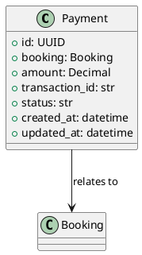
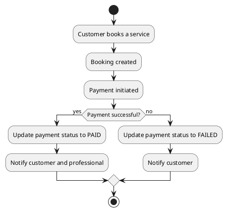

# Payment Module Documentation

## Overview

This document describes the Payment module, its models, endpoints, and workflows in the serviceBridge project.

## UML Diagrams

### 1. Payment Model UML

### 2. Payment Workflow UML

## Endpoints

- `POST /payments/` - Create a new payment
- `GET /payments/{id}/` - Retrieve payment details
- `GET /payments/` - List all payments

## Fields

- `booking`: Related booking
- `amount`: Payment amount
- `transaction_id`: Unique transaction reference
- `status`: Payment status (e.g., PENDING, PAID, FAILED)
- `created_at`, `updated_at`: Timestamps

---

For more details, see the Payment model and API code.
